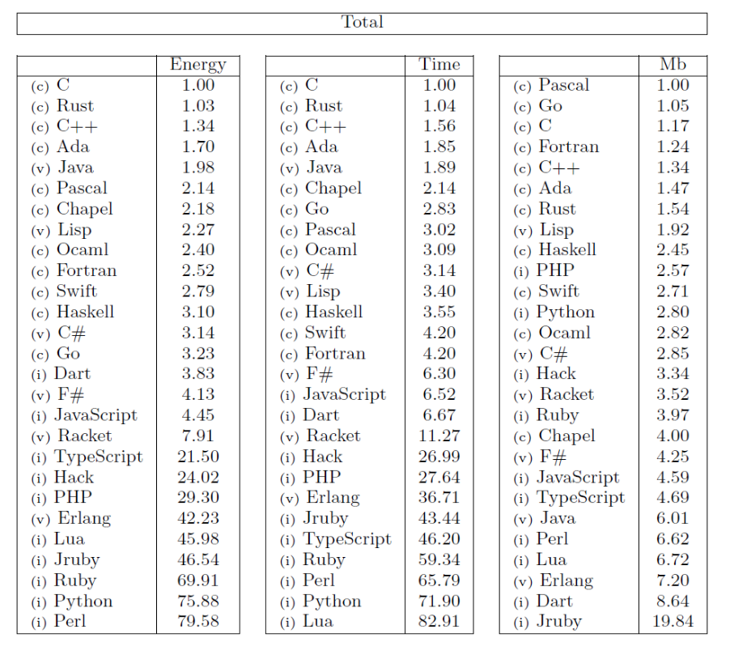

# Green Software

- [Green software manifesto](https://greensoftware.foundation/manifesto)

## Why

- We have a responsibility
- Why not?
- It's fun

## Why not
- It can add complexity

## How
- Increase awareness
- Teach
- Use modern hardware
- Choose language wisely

## Real life cases
- Kronaby

## Ideas
- Piggy bag on Seq's logs
- Fetch batches on startup

## Demo
Imagine a situation with negative power cost (it has happened)
Do a power consuming task at that point