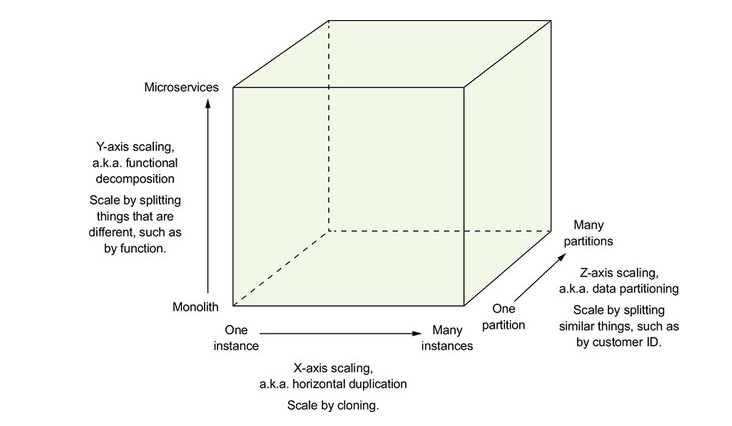

# Scalability Cube

### Cube dimensions
- X-axis, Horizontal duplication
- Y-axis, Functional decomposition. Split functions into smaller parts
- Z-axis, Data partitioning. Imagine Tax Returns based on birthday

We should always design for 2 axis of scale

### Demo application
- Services are split up on the Y-axis in PingerService and PongerService
- The PongerService is split on the X-axis
